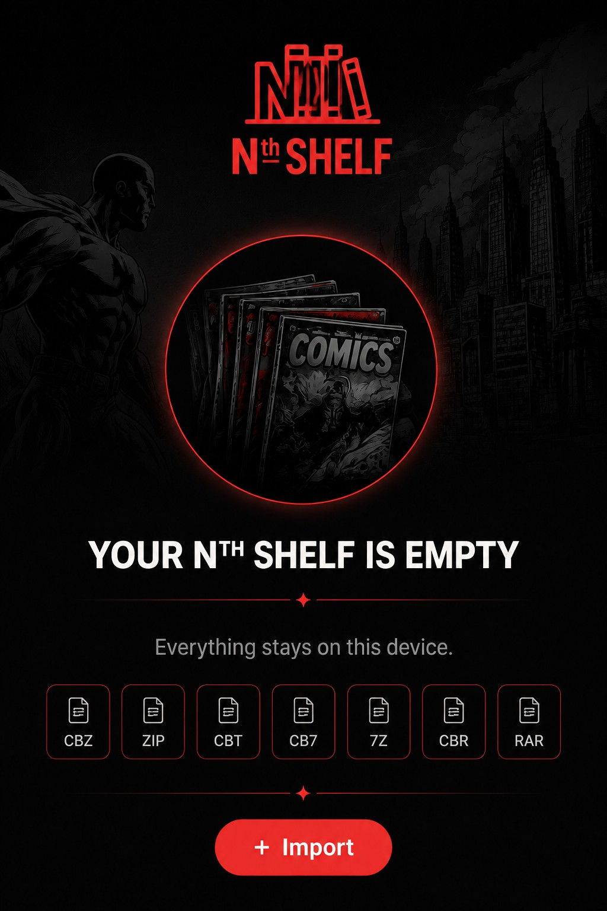

# Nth Shelf

**Nth Shelf** is a local-first comic reader and personal comic library built as an installable Progressive Web App.

**Everything stays on this device.**

## ✨ Features

### 📚 Personal Comic Library
- Import **CBZ, ZIP, CBT, CB7, 7Z, CBR, and RAR** comics.
- Import a ZIP containing multiple supported comic archives as a batch.
- Search your collection.
- Organize comics into collections.
- Track reading progress and unread status.
- Sort by **Recent, Title, Unread, In Progress,** and **ADDED**.
- Use **↑ ASC / ↓ DESC** ordering.
- The library starts in **ASC** order by default.
- **ADDED** sorts by the time comics were imported.

## 🔎 Animated Search Mode
- Browse covers in an animated, console-style carousel.
- The selected cover becomes larger and centered.
- Neighboring covers shrink, fade, and angle away for depth.
- Swipe, tap, use arrows, or use keyboard navigation.
- Search filters the carousel live.
- Tap the centered cover to open it.

### 🔖 Animated Bookmarks
- Switch Search Mode to **Bookmarks**.
- Browse bookmarked pages using the same animated carousel.
- See bookmarks from different comics together.
- Filter bookmarks by comic title.
- Select a bookmark to jump directly to that page.

## 📖 Reading Modes
- **Page** — one page at a time.
- **Two Page** — two pages side by side.
- **Scroll** — continuous horizontal reading.
- **Manga** — continuous horizontal right-to-left reading.
- **Webcomic** — continuous vertical reading.

### Two Page Fullscreen
Two Page automatically requests fullscreen and landscape orientation for a larger, more readable spread.

The **Exit Fullscreen** button appears only in Two Page fullscreen landscape.

## 💬 Bubble Zoom
- Double-tap a detected bubble.
- The page dims behind the enlarged bubble.
- The bubble appears as a readable pop-out.
- Bubble positioning adapts to the reading layout.
- Two Page supports bubbles on either displayed page.

## 🖱️ Auto Scroll
Auto Scroll is available in **Scroll, Manga,** and **Webcomic** modes.

- The **Auto Scroll** button appears only in modes that support continuous scrolling.
- The button is dark when off and red when active, matching the Bubble Zoom control style.
- Use the speed control to select **0.0x, 0.33x, 0.50x, 0.66x,** or **1.0x**.
- Use the play/pause control to stop and resume scrolling without leaving the mode.
- The control panel fades almost completely into the artwork while idle and becomes visible when interacted with.
- The control panel can be moved to a more convenient position.
- Auto Scroll automatically stops when switching to a reading mode that does not support it, preventing unexpected movement when changing modes.

## 🔖 Bookmarks & Progress
- Bookmark the current page.
- Return directly to bookmarked pages.
- Preserve reading position locally.
- Keep collections and metadata with the local library.

## 🎨 Themes
Use the built-in theme swatches to change the reading appearance.

## 💾 Backup & Restore
Back up and restore comics, collections, bookmarks, reading progress, and library metadata.

**Recommendation:** keep a current backup before major browser or device changes.

## 🛡️ Persistence Protection
Nth Shelf uses IndexedDB for local storage and keeps a stable database identity across application updates. It records library metadata and requests persistent browser storage where supported, helping protect against accidental storage loss.

## 📱 Installable & Offline-Friendly
Nth Shelf can be installed as a PWA on supported devices. The app shell is cached for offline use, subject to browser storage and locally available content.

## 🧰 Supported Formats

| Format | |
|---|:---:|
| CBZ | ✅ |
| ZIP | ✅ |
| CBT | ✅ |
| CB7 | ✅ |
| 7Z | ✅ |
| CBR | ✅ |
| RAR | ✅ |

## 🚀 Getting Started
1. Open Nth Shelf.
2. Import a comic or a ZIP containing supported comic archives.
3. Choose a reading layout.
4. Search or organize your shelf.
5. Bookmark pages you want to revisit.
6. Use Bubble Zoom or Auto Scroll when appropriate.
7. Use Backup/Restore to keep a safety copy.

## 🧪 Current Release
**Version 2.71**

This release adds **Shelf Mode**, an interactive 3D-style cover shelf inspired by console library cover browsing. The shelf presents a continuous line of comic covers with the selected comic centered as the hero. Swipe left/right or use the arrow keys to move through the shelf, and tap the center comic to open it. Shelf Mode is launched from the red button beside Import and can be closed at any time.

The current Nth Shelf feature set includes animated Search and Bookmarks, ASC/ADDED sorting, nested archive imports, Two Page fullscreen, Bubble Zoom, Auto Scroll controls, persistence protection, and the new Shelf Mode library view.

## 🔒 Privacy
Nth Shelf is designed around local-first storage. Your comics are stored on your device rather than uploaded to an Nth Shelf server simply to read them.

## 📜 License
This project is licensed under the **MIT License**. The license applies to the software and does not grant rights to comic artwork or other copyrighted material imported by users.

---

**Nth Shelf**  
*Your comics. Your shelf. Your device.*

### v2.62 Test Note
- Adds a temporary **2.0x Auto Scroll** speed endpoint for iPhone testing. Existing speed settings are unchanged.

### v2.63
- Bubble Zoom detection is now intentionally conservative: it recognizes white and slightly off-white bubble interiors while rejecting most brightly colored artwork highlights.

### v2.64
- Bubble Zoom now uses additional shape and interior-ink checks.
- White/off-white color alone is no longer sufficient to qualify as a bubble.
- Bright artwork regions are filtered more aggressively while preserving normal speech balloons.

### v2.65
- Tightened Bubble Zoom false-positive filtering for irregular bright artwork.
- Requires stronger bubble-outline evidence and more interior ink/text evidence.
- Rejects larger low-fill, weak-shape candidates while preserving normal speech balloons.

### v2.66
- Bubble Zoom adds a dark enclosed-boundary test to reject irregular bright artwork regions.
- Legitimate speech balloons remain supported through the existing white/off-white, outline, fill, and interior-ink checks.

### v2.67
- Adds Shelf Mode with a continuous 3D-style comic cover line and centered hero cover.
- Shelf Mode supports swipe/drag browsing, keyboard arrows, center-cover selection, and a close control.
- Adds a Shelf Mode button beside the Import button using the existing Nth Shelf red pill styling.
- Shelf Mode works with the current library sorting, collections, and cover data without changing the reading experience.

### v2.68
- Added Cinematic Shelf styling to Shelf Mode: stronger depth, spotlight treatment, reflections, atmospheric dimming, and a subtle idle float on the selected cover.
- Added cinematic motion to the normal library: staggered cover entrance, lift/tilt on hover or pointer interaction, cover zoom, and grounded shadows.
- Honors reduced-motion preferences.

### v2.69
- Reworked Cinematic Shelf into a more pronounced 3D presentation with curved depth, perspective, overlap, and a centered hero cover.
- Shelf Mode now uses a two-tap interaction: first tap selects and animates the centered comic; second tap opens it.
- Tapping a side cover moves it into the hero position without opening it.
- Normal library cards now use the same two-step cinematic interaction: first tap lifts/selects a cover, second tap opens it.
- Added a short “Tap again to open” cue after selection.

### v2.71
- Shelf Mode now presents a continuous visible line of comic covers around the centered hero.
- Wider spacing and lighter side covers make neighboring comics clearly visible.
- Changing the centered comic always clears the previous comic's cinematic/second-tap state.
- The newly centered comic requires a fresh first tap before opening.
