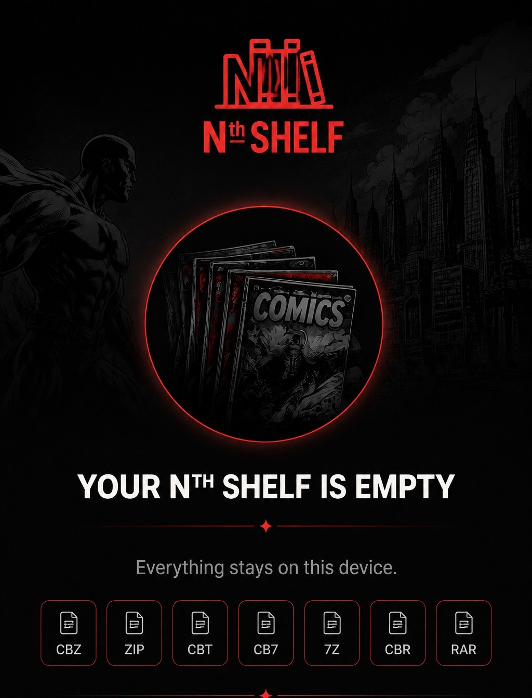

# Nth Shelf

**Nth Shelf** is a local-first comic reader and personal comic library built as an installable Progressive Web App.

**Everything stays on this device.**

## ✨ Features

### 📚 Personal Comic Library
- Import **CBZ, ZIP, CBT, CB7, 7Z, CBR, and RAR** comics.
- Import a ZIP containing multiple supported comic archives as a batch.
- Search your collection.
- Organize comics into collections.
- Track reading progress and unread status.
- Sort by **Recent, Title, Unread, In Progress,** and **ADDED**.
- Use **↑ ASC / ↓ DESC** ordering.
- The library starts in **ASC** order by default.
- **ADDED** sorts by the time comics were imported.

## 🔎 Animated Search Mode
- Browse covers in an animated, console-style carousel.
- The selected cover becomes larger and centered.
- Neighboring covers shrink, fade, and angle away for depth.
- Swipe, tap, use arrows, or use keyboard navigation.
- Search filters the carousel live.
- Tap the centered cover to open it.

### 🔖 Animated Bookmarks
- Switch Search Mode to **Bookmarks**.
- Browse bookmarked pages using the same animated carousel.
- See bookmarks from different comics together.
- Filter bookmarks by comic title.
- Select a bookmark to jump directly to that page.

## 📖 Reading Modes
- **Page** — one page at a time.
- **Two Page** — two pages side by side.
- **Scroll** — continuous horizontal reading.
- **Manga** — continuous horizontal right-to-left reading.
- **Webcomic** — continuous vertical reading.

### Two Page Fullscreen
Two Page automatically requests fullscreen and landscape orientation for a larger, more readable spread.

The **Exit Fullscreen** button appears only in Two Page fullscreen landscape.

## 💬 Bubble Zoom
- Double-tap a detected bubble.
- The page dims behind the enlarged bubble.
- The bubble appears as a readable pop-out.
- Bubble positioning adapts to the reading layout.
- Two Page supports bubbles on either displayed page.

## 🖱️ Auto Scroll
Auto Scroll is available in **Scroll, Manga,** and **Webcomic** modes.

- The **Auto Scroll** button appears only in modes that support continuous scrolling.
- The button is dark when off and red when active, matching the Bubble Zoom control style.
- Use the speed control to select **0.0x, 0.33x, 0.50x, 0.66x,** or **1.0x**.
- Use the play/pause control to stop and resume scrolling without leaving the mode.
- The control panel fades almost completely into the artwork while idle and becomes visible when interacted with.
- The control panel can be moved to a more convenient position.
- Auto Scroll automatically stops when switching to a reading mode that does not support it, preventing unexpected movement when changing modes.

## 🔖 Bookmarks & Progress
- Bookmark the current page.
- Return directly to bookmarked pages.
- Preserve reading position locally.
- Keep collections and metadata with the local library.

## 🎨 Themes
Use the built-in theme swatches to change the reading appearance.

## 💾 Backup & Restore
Back up and restore the metadata for your comics, collections, bookmarks, reading progress, and library. You'll need to re sync your collection, however if db gets destroyed.

**Recommendation:** keep a current backup before major browser or device changes.

## 🛡️ Persistence Protection
Nth Shelf uses IndexedDB for local storage and keeps a stable database identity across application updates. It records library metadata and requests persistent browser storage where supported, helping protect against accidental storage loss.

## 📱 Installable & Offline-Friendly
Nth Shelf can be installed as a PWA on supported devices. The app shell is cached for offline use, subject to browser storage and locally available content.

## 🧰 Supported Formats

| Format | |
|---|:---:|
| CBZ | ✅ |
| ZIP | ✅ |
| CBT | ✅ |
| CB7 | ✅ |
| 7Z | ✅ |
| CBR | ✅ |
| RAR | ✅ |

## 🚀 Getting Started
1. Open Nth Shelf.
2. Import a comic or a ZIP containing supported comic archives.
3. Choose a reading layout.
4. Search or organize your shelf.
5. Bookmark pages you want to revisit.
6. Use Bubble Zoom or Auto Scroll when appropriate.
7. Use Backup/Restore to keep a safety copy.

## 🧪 Current Release
**Version 2.78.21 Orthogonal Authority Gate Test**

## 🧪 Release History (Newest First)

## V2.78.21 Orthogonal Authority Gate Test

V2.78.21 prevents the tap-neighborhood rescue from replacing known good orthogonal geometry. V73 and V100 panel identities now remain authoritative rectangles. A clean, panel-scale V99/V92 result also remains a rectangle; only an oversized or composite V99 seed may enter the bounded local-seed rescue. Wide, shallow panels are no longer considered suspicious merely because they occupy more than half the page width. Logs now report `ORTHOGONAL AUTHORITY HOLD ...` for protected rectangles and `COMPOSITE SEED RESCUE ELIGIBLE ...` when the skew-frame search is allowed. The exact orthogonal seed captured in the phone recording was preserved, while five taps on the oversized `140153.jpg` middle-row seed still recovered the intended right-hand skewed frame.

## V2.78.20 Tap-Neighborhood Frame Consensus Test

V2.78.20 fixes two failures exposed by the `140153.jpg` sandbox comparison. Rail adjacency is judged relative to competing rails on the same side, and oversized or weak seeds trigger a bounded set of local panel-scale seeds and nearby tap probes. Only closed, convex, tap-containing four-rail families remain eligible. Five sandbox tap positions converged on the same complete skewed frame. Ownership remained deferred.

## V2.78.19 Neighbor-Side Consistency Test

V2.78.19 adds neighbor-side consistency as ranking evidence after closed-loop validation. Each candidate rail samples the dark rail and the image regions immediately on both sides. This evidence cannot manufacture an open rail or bypass the closed-family protections.

## V2.78.18 Outermost Coherent Loop Test

V2.78.18 retains all structurally credible closed families, measures how much of the stable panel seed each explains, and prefers the outermost coherent panel-scale enclosure among candidates whose rail and corner evidence remains close to the best evidence.

## V2.78.17 Chain-Connected Rail Family Test

V2.78.17 generates several plausible rails per side and searches for one closed rail family around the tap: top → right → bottom → left → top. Every selected rail must participate in the same finite, connected enclosure.

## V2.78.16 Endpoint Convergence / Short-Bridge Corners Test

V2.78.16 allows a tightly bounded short bridge when two proven neighboring rail endpoints stop just before a real frame corner. Infinite extrapolation remains forbidden, and bridged corners are explicitly logged.

## V2.78.13 Junction-Locked Envelope Test

V2.78.13 keeps the V2.78.12 whole-frame envelope architecture but adds per-corner junction locking. Each inferred corner must snap to nearby local evidence from both neighboring frame rails.

## V2.78.12 Whole-Frame Envelope Test

V2.78.12 moves full-frame recovery ahead of geometry ownership. The stable detector identifies the tapped panel, then the frame-envelope stage searches for a complete four-sided enclosure. It rejects tiny interior slivers, requires a convex tap-containing polygon, and falls back to the stable rectangle when a complete envelope cannot be proven.

## V2.78.11 Vertex / Angle Ownership Test

V2.78.11 separates geometry ownership from full skewed-frame extraction. The skewed module fits four local sides, intersects them into corners, measures angles and opposing-side divergence, and grants skewed ownership only when the vertex geometry proves a non-orthogonal quadrilateral. This build still rendered the stable seed rectangle.

## V2.78.10 Skew Proof Gate Test

V2.78.10 requires an opposing rail pair to prove meaningful angular divergence or a strong shared lean before the skewed engine may own a tap. One isolated diagonal rail can no longer claim an otherwise orthogonal panel.

## V2.78.09 Skewed Ownership Test

V2.78.09 lets a proven three-rail skew candidate claim temporary ownership and reacquire a missing fourth rail at the scale of the stable panel seed. Final polygons must remain local, convex, and tap-containing.

## V2.78.08 Tap-Anchored Enclosure Test

V2.78.08 anchors rail selection to the user's tap. Each side is selected as the nearest sustained enclosing rail, while final polygons remain constrained by convexity, area, locality, and tap containment.

## V2.78.07 Skewed Classifier + Corner Freedom Test

V2.78.07 lets high-confidence oblique evidence influence classification and gives corners directional freedom near strongly supported oblique rails while retaining convexity, area, containment, and four-rail checks.

## V2.78.06 Directional Rail Search Test

V2.78.06 searches line hypotheses that may migrate progressively away from the orthogonal seed and robustly refits them to dark frame ink. Skewed geometry must still prove four coherent rails and a valid convex polygon.

## V2.78.04 Trace Stabilizer Test

V2.78.04 fits each rail as one robust, mostly straight structure with distributed support. Opposing rails, corner locality, convexity, area, support, and coverage checks reject malformed artwork-driven cutouts.

## V2.78.03 Trace Authority Test

V2.78.03 gives boundary tracing the first chance to prove four true rails after a V99/V92 fallback seed. Two-side legacy candidates are rejected when tracing cannot prove the missing geometry; four-side candidates retain a safe rectangular fallback.

## V2.78.02 Boundary Trace Test

V2.78.02 adds an experimental geometry branch to the stable hybrid baseline. V100 identifies the panel, V102 may trace a four-corner polygon, and weak tracing preserves the stable rectangle.

## 🔒 Privacy

Nth Shelf is designed around local-first storage. Your comics are stored on your device rather than uploaded to an Nth Shelf server simply to read them.

## 📜 License

This project is licensed under the **MIT License**. The license applies to the software and does not grant rights to comic artwork or other copyrighted material imported by users.
